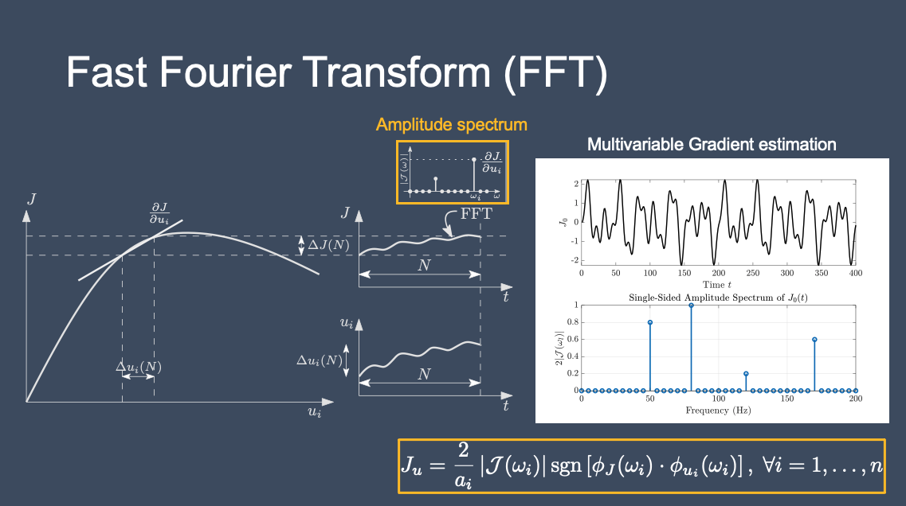
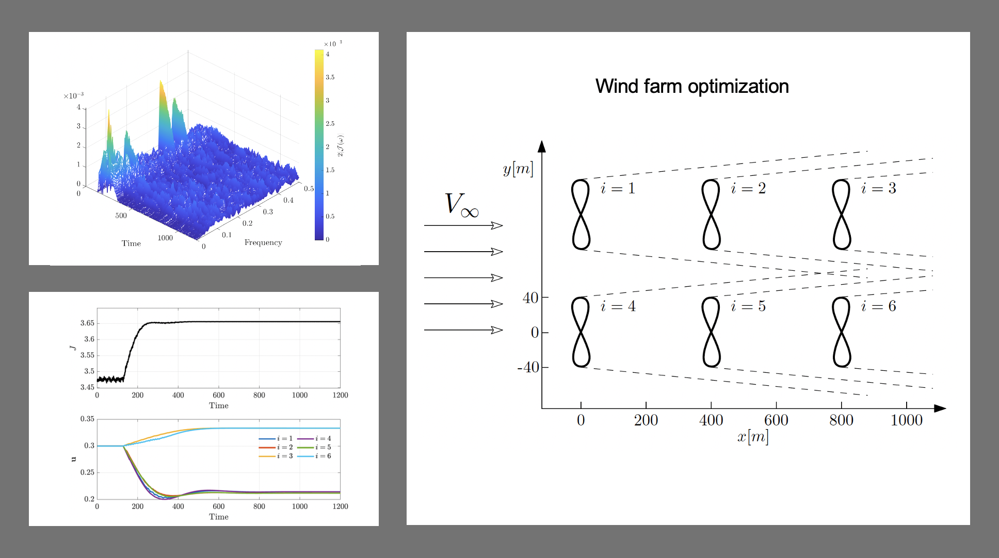

 # A Multivariable Extremum Seeking Control Approach using Fast Fourier Transform for Gradient Estimation
 
This repository contains the MATLAB code that implements a multivariable extremum seeking scheme using Fast Fourier Transform (FFT) for the gradient estimation. In the proposed method, the different inputs are perturbed at different frequencies, and  the power spectrum of the output signal, obtained using FFT,  is used to estimate the steady-state cost gradient w.r.t. each input channel. More precisely, the amplitude spectrum of the cost signal at each perturbation frequency provides the magnitude of the  cost gradient with respect  to the corresponding input, and the phase spectrum provides the sign of the gradient. The input signals are then updated using integral action in order to drive the respective gradients to zero. Fast Fourier transform is an easy, robust, and effective numerical approach to estimate the steady-state gradient in the multivariable case. 

The MATLAB code implements the FFT-based multivariable extremum seeking scheme for a wind farm power optimization problem with 6 wind turbines.

